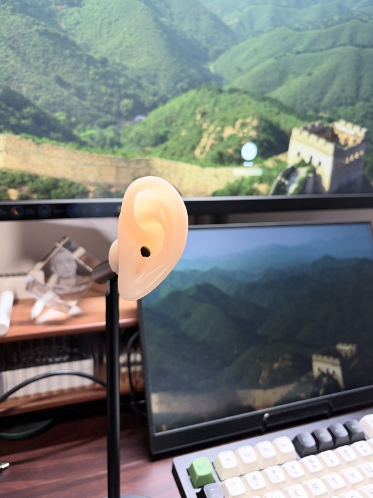
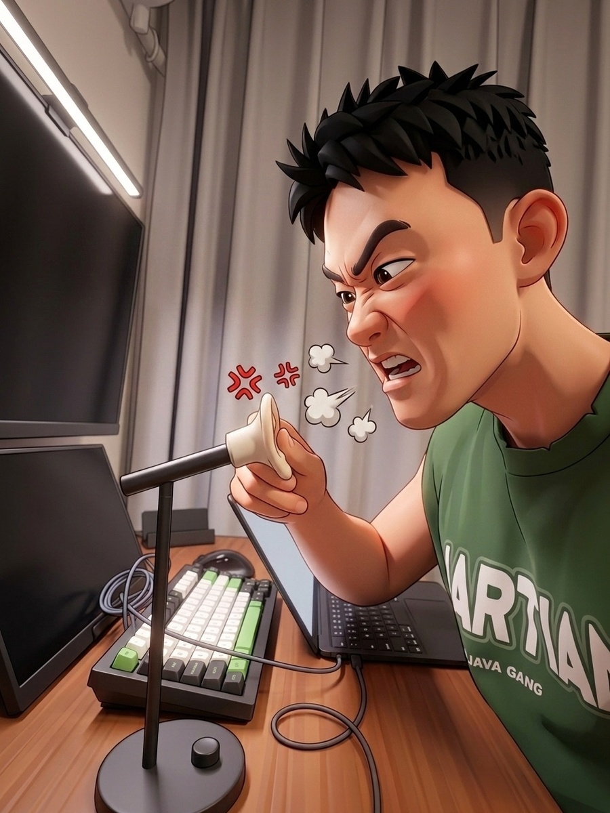

Lately, I’ve been talking to AI with extreme intensity. Thoughts fire off in my head faster than my fingers can type, and typing inevitably forces you to self-censor and trim details.

My Mac Mini desperately needed a comfortable microphone setup. To find the right fit, I experimented with several options:

First came AirPods. Wearing them all day made my ear canals ache, and they left me feeling unnervingly cut off from my surroundings.

Then I tried open-ear headphones. They solved the ear fatigue, but having something clamped to my skull all day felt constricting.

I even tried a handheld dynamic mic, but clutching it immediately triggered public-speaking mode—my posture stiffened, feeling absurdly formal.

After all that trial and error, the most natural form factor was simply a microphone standing quietly on the desk.

---

The turning point came one afternoon while pairing with Codex. It was a minuscule tweak, but the model kept missing the point and messing up. I was getting legitimately annoyed.

In real life, when someone repeatedly fails to understand what you're saying, your primal impulse is to grab their ear and spell it out word for word.

Staring at the cold metal mic arm in front of me, the thought struck me like lightning. I tracked down a silicone prosthetic ear, made an incision, and slipped it directly over the microphone's pickup capsule.

At that exact moment, something subtle shifted.

Rationally, it's still just an acoustic transducer passing audio into a buffer. But emotionally, my desire to articulate thoughts to it skyrocketed. Whenever my reasoning gets tangled, or whenever the AI drives me up the wall, I can literally reach out, grab that ear standing on my desk, and talk straight into it.

This wasn't just accessorizing a microphone—it gave an invisible, intangible AI an anchor in the physical world. At the very least, next time it frustrates me, there’s an actual ear on my desk I can grab.
