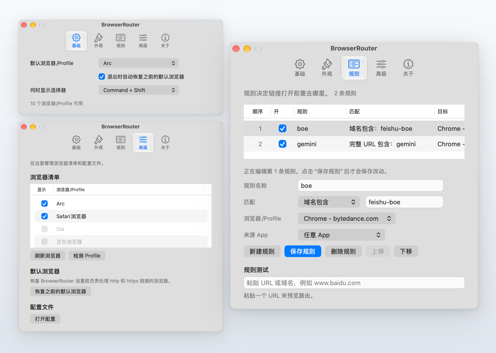

我认为现在 macOS 对「默认浏览器」的定义依然停留在单选时代，这已经非常不符合现代用户的工作流了。

在日常使用中，很多人（包括我自己）在 Chrome 里面建了非常多的 Profile，但平时点开一个外部链接时，系统并不会智能跳转到我们需要的那个 Profile 实例中；更何况我们通常也不止一个浏览器，比如我日常可能用 Safari，而工作时又重度依赖 Arc 浏览器。

为了不让账号和上下文乱成一团，以往最笨但也最稳妥的做法就是右键复制链接、找到正确的浏览器窗口、再手动粘贴打开。我受够了这种微小但高频的打断，于是动手写了这个原生的 macOS 菜单栏小工具：[BrowserRouter](https://github.com/KhalilHsu/browserSwitch)。

它的逻辑非常直接：把自己注册为 macOS 系统的默认 HTTP/HTTPS 协议处理器，当其他应用发起“打开链接”请求时，BrowserRouter 会在毫秒级内根据预设规则进行定向路由。

在分流逻辑的设计上，我主要聚焦在三个核心环节：

第一是**按来源应用与域名智能分流**。比如从 Slack、飞书或工作邮件点出来的链接，自动送进工作浏览器；从微信、Telegram 或 RSS 阅读器点出来的，则直接交给日常阅读浏览器。

第二是**原生 Profile 级精准唤起**。深度支持 Chromium 系列与各类现代浏览器的多 Profile 机制，直接将链接送进指定的 Profile 实例，无需编写任何额外的分流脚本。

第三是**跟手的手动分流选择器（Chooser）**。遇到临时测试链接或 OAuth 登录回调时，只需在点击链接的同时按住修饰键，光标位置就会即刻弹出一个轻盈的原生选择面板，快速完成手动分流。

把外链交给对的浏览器之后，那种“点开链接前先在心里犹豫一秒”的微小心理负担彻底消失了。

> **项目地址**：[GitHub - KhalilHsu/browserSwitch](https://github.com/KhalilHsu/browserSwitch)
> **产品官网**：[BrowserRouter 官方主页](https://khalilhsu.github.io/browserSwitch/)
