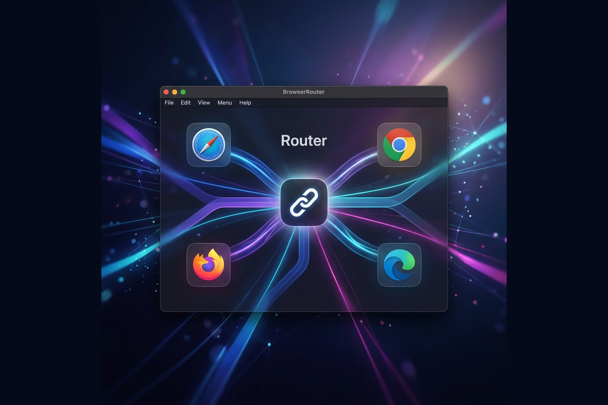

在日常使用 Mac 时，我的工作流里往往同时并存着几种完全割裂的上下文：

一个是工作环境——公司的 Google Workspace、内部看板、Slack 与企业通讯录；另一个是个人环境——干净的 Safari、私人的 GitHub 账号与日常阅读；此外还有开发调试时的独立 Chrome Profile，以及各种需要干净会话进行 OAuth 鉴权或多租户测试的临时窗口。

但 macOS 对「默认浏览器」的定义依然停留在单选时代：全系统只能选定一个默认浏览器。

这种割裂导致每天都会发生无数次让人烦躁的摩擦：在 Slack 或邮件里点开一个内网文档，它冷不防地在个人 Safari 里打开并提示“无权访问”；在个人聊天软件里点开一个链接，又顺手把私人浏览记录和 Cookie 污染进了工作的 Chrome 里。

为了不让账号和状态乱成一团，以往最稳妥的做法反而是极其低效的笨办法——右键复制链接，找到对应的浏览器窗口，新建标签页，再手动粘贴打开。

我受够了这种微小但高频的打断，于是动手写了一个原生的 macOS 工具：[BrowserRouter](https://github.com/KhalilHsu/browserSwitch)。

它的逻辑非常直接：把自己注册为 macOS 系统的默认 HTTP/HTTPS 协议处理器。当其他应用程序发起“打开网址”的请求时，macOS 会第一时间把 URL 抛给 BrowserRouter，由它在毫秒级内根据规则进行分发。

在设计分流逻辑时，我重点解决了三个最关键的环节：

第一个是**按来源应用（Source Application）分流**。很多时候我们甚至不需要看网址是什么——只要这个链接是从 Slack、飞书或公司邮件客户端里点出来的，它 100% 应该进入工作专用的 Chrome Profile；而从微信、Telegram 或 RSS 阅读器里点出来的链接，理所当然应该交给日常阅读的 Safari。配合域名后缀与路径前缀规则，绝大多数外链在点击的瞬间就已经完成了无感路由。

第二个是**原生 Profile 级发现与唤起**。市面上很多类似工具只能按 App 粒度切换，但现代前端与产品开发几乎都在深度依赖 Chromium 的多 Profile 机制。BrowserRouter 原生扫描了系统中的 Chrome、Edge、Brave、Vivaldi 以及 Firefox 配置，可以直接通过 `--profile-directory` 启动参数把链接送进指定的 Profile 实例中，无需自行编写任何脚本。

第三个是**跟手的手动分流器（Chooser）**。并不是所有链接都能被固定规则完全覆盖，尤其是 OAuth 登录回调、临时测试环境或客户的多租户站点。BrowserRouter 支持全局快捷键监听：当你在点击链接的同时按住修饰键（例如 `Command + Shift`），光标所在位置会即刻弹出一个轻盈的原生选择面板，按下数字键或直接点击即可完成定向分流。

为了保持体验的纯粹，整个项目完全使用 Swift 与 AppKit 构建：

- 零网络请求，配置全部保存在本地 Application Support 的 JSON 文件中，不采集任何浏览偏好。
- 启动常驻仅消耗极少系统资源，支持隐藏 Dock 与菜单栏图标进入完全无感的后台 Helper 模式。
- 内置了平滑的接管与还原机制，退出时会自动将系统的默认浏览器还原回接管前的状态，绝不劫持系统配置。

把外链交给对的浏览器之后，那种“点开链接前先在心里犹豫一秒”的微小心理负担彻底消失了。

如果你也经常在多个浏览器与账号之间反复切换，可以在 [GitHub 仓库](https://github.com/KhalilHsu/browserSwitch) 查看源码与安装脚本，或者访问 [BrowserRouter 介绍页](https://khalilhsu.github.io/browserSwitch/) 了解更多细节。
