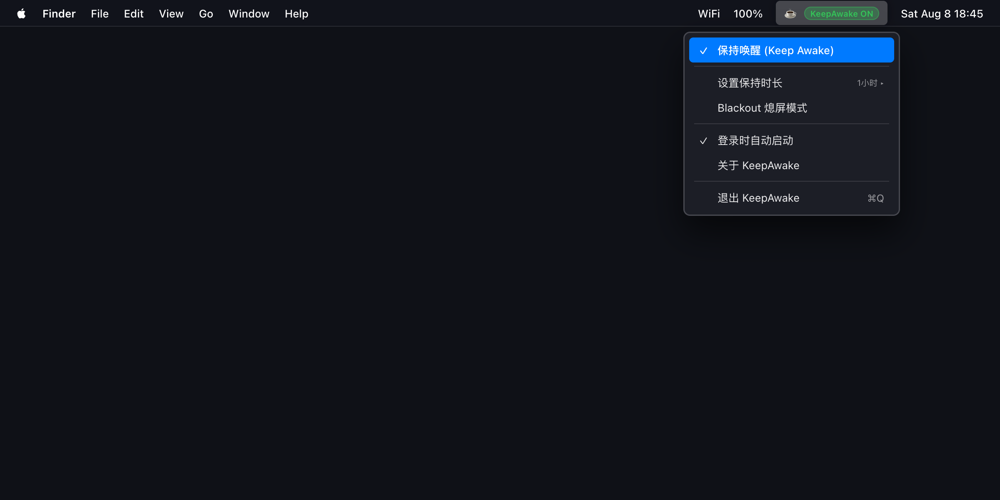

自从把越来越多繁重的工作交给本地 Agent 和后台自动化流水线之后，我的 Mac 迎来了一个新的常态：即使我离开了书桌，它依然在全速运转。

让 Agent 跑几十轮代码重构、爬取一批动态渲染的网页、跑长上下文的推理与多模态测评，或者在后台挂着几个 G 的数据集下载——这些任务往往需要几十分钟甚至数个小时。

但只要我起身去泡杯茶，或者晚上躺下睡觉，macOS 就会严格执行它的“节能守则”：几分钟无操作后准时锁屏、关闭显示输出，随后切入系统休眠。

终端里的任务戛然而止，正在执行 Computer Use 的 Agent 因为找不到屏幕视口而抛错报错，第二天早上满怀期待地掀开电脑，面对的往往是一串停在半途的错误日志。

解决这个问题的传统手段很多，但几乎每一个都有点别扭：

最原生的是终端里的 `/usr/bin/caffeinate`。但每次都要打开命令行敲一段带参数的指令不仅麻烦，而且最容易“忘关”——合上盖子放进背包，几个小时后掏出来电脑已经滚烫、电量掉光；市面上的防休眠菜单栏工具也不少，但往往夹杂着复杂的配置、臃肿的 Web 包装，甚至还有网络上报。

为了给后台任务和本地 Agent 一个最轻快、最让人放心的运行环境，我写了这个原生的 macOS 菜单栏小工具：[KeepAwake（CoffeeORTea）](https://github.com/KhalilHsu/CoffeeORTea)。

它的核心逻辑非常纯粹：像给 Mac 倒了一杯咖啡一样，一键让系统保持清醒；不需要时，轻轻一拨恢复正常的系统节律。

在实现这个小工具时，我把注意力放在了三个最契合日常工作流的细节上：

第一是**刚刚好的定时作息**。很多时候我们并不希望电脑“永远不睡”，只是需要它“把眼前的活干完”。KeepAwake 内置了 15 分钟、1 小时、3 小时等常用档位，以及一个专为睡前派活设计的选项——**「直到明早 8:00」**。晚上睡前把任务派给 Agent，让它喝着咖啡通宵干活；天亮之后，系统自动重置回正常的休眠与锁屏策略，不会在白天闲置时白白耗电。

第二是**为 GUI Agent 定制的「Blackout 黑屏保帧模式」**。这是在折腾自动化和 Computer Use 场景时遇到的最大痛点：
- 如果让 macOS 正常关闭显示器，系统底层会直接销毁显示帧缓冲区（FrameBuffer）与虚拟桌面拓扑，正在通过截图感知界面的 Agent 会瞬间变成“盲人”，OCR 和视觉定位全部失效；
- 但如果一直把屏幕亮着，夜晚的卧室或书房又会被显示器的高亮度照得通亮。

Blackout 模式的做法很克制：它不会向硬件发送切断信号的关屏指令，而是通过 `DisplayServices` 接口将内置屏幕亮度调至 0，并通过 `DDC/CI` 协议将外接显示器的背光与亮度降至最低。在物理上屏幕一片漆黑，但 macOS 的图形管线和窗口拓扑依然完整保持激活状态。Agent 可以在完全黑暗中继续流畅地截图、识别与点击，既不打扰睡眠，也不会断流。

第三是**优雅跟手的唤醒与安全兜底**。只要快速晃动鼠标，或者在短时间内连续敲击 3 次键盘，屏幕背光就会在毫秒内瞬间恢复。为了防止极端意外（比如进程异常退出导致屏幕无法还原亮度），KeepAwake 设计了受保护的恢复状态文件与独立的 Watchdog 守护机制，做到了最大限度的故障自愈。

为了保持体验的克制与干净，整个项目完全使用 Swift 与 AppKit 原生编写：

- 零第三方运行时依赖，不引入任何重型框架，纯 Universal Binary（Apple Silicon + Intel）构建。
- 零网络请求，无任何遥测或数据收集，完全在本地安静运行。
- 严格遵循系统权限边界，不越权绕过手动锁屏或密码鉴权，退出时干净释放所有断言。

给桌上的 Agent 倒上一杯咖啡，然后安心合眼或者出门走走。那些耗时耗力的繁重任务，就交给它在夜色里安静搞定吧。

如果你也经常在 Mac 上跑通宵任务或本地 Agent，可以在 [GitHub 仓库](https://github.com/KhalilHsu/CoffeeORTea) 查看源码与构建脚本，或者访问 [KeepAwake 介绍主页](https://khalilhsu.github.io/CoffeeORTea/) 了解更多细节。
