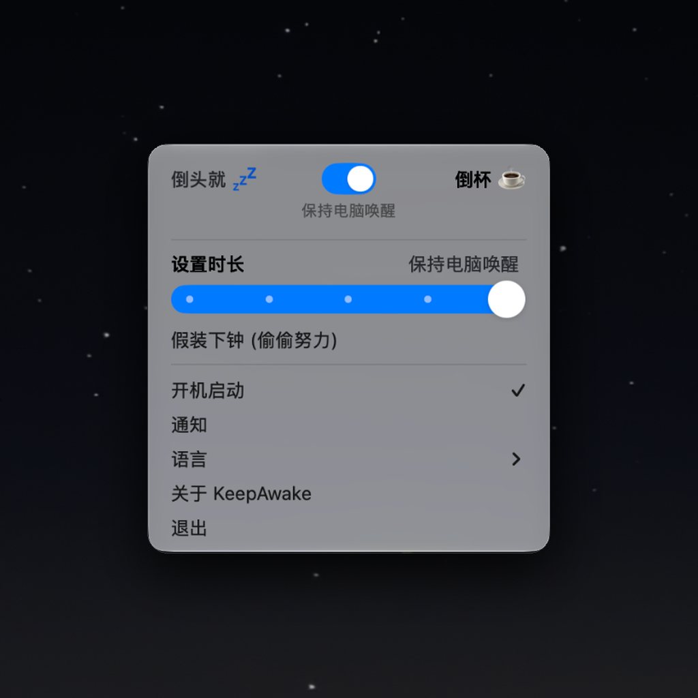

Once, I queued up a heavy task for a Codex Agent that required Computer Use and left my desk to play basketball. Two hours later, I returned, flipped open my MacBook, and found that macOS had locked the screen right after I stepped away. The agent hadn't done a single thing. It was infuriating.

There are plenty of traditional anti-sleep tricks out there. The most native one is `caffeinate` in the terminal, but it's dangerously easy to forget. Close the lid, toss your laptop into your backpack, and pull it out hours later to find a boiling-hot battery that's down to 0%. Third-party menu bar utilities exist too, but they're often bogged down with convoluted settings, bloated Electron wrappers, and unnecessary telemetry pings.

To give my local agents a lightweight, reliable runtime environment, I wrote a native macOS menu bar app: [KeepAwake (CoffeeORTea)](https://khalilhsu.github.io/CoffeeORTea/).

Its core premise is dead simple: like pouring a cup of coffee for your Mac, a single toggle keeps the machine awake. When you're done, flick it off to restore normal system sleep cycles.

I also baked in a stealth mode: **"Feigning Sleep While Grinding Hard" (Blackout)**. Leaving displays blazing all night while running overnight jobs is blinding. But if you actually sleep the displays via macOS, the system dismantles the GPU rendering pipeline, which completely blinds visual Computer-Use agents. Blackout simply cranks display brightness down to pitch-black while keeping all windows and rendering buffers fully active behind the scenes. To the outside eye, the Mac looks asleep; in reality, the agent is quietly snapping screenshots, analyzing layouts, and running uninterrupted in the dark.

To keep the app lean and clean, the entire project is written natively in Swift and AppKit:

* **Zero third-party runtime dependencies**: No heavy frameworks, built as a pure Universal Binary (Apple Silicon + Intel).
* **Zero network calls**: No telemetry, no analytics, 100% local and quiet.

Pour your desktop agent a cup of coffee, close your eyes, or go for a walk. Let the machine quietly grind through the heavy lifting in the background.

> **Repository**: [GitHub - KhalilHsu/CoffeeORTea](https://github.com/KhalilHsu/CoffeeORTea)  
> **Official Site**: [KeepAwake Homepage](https://khalilhsu.github.io/CoffeeORTea/)
