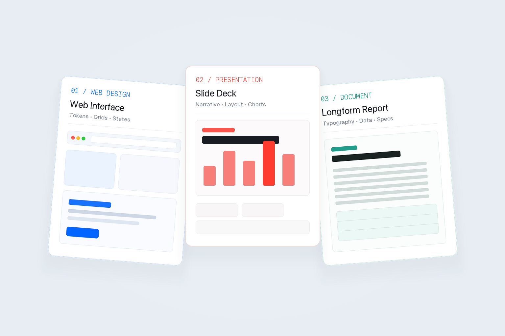

平心而论，每次看到有人把给 AI 写几段 Markdown 规则包装成某种颠覆性的 Skill，我都觉得有点用力过猛。

前段时间我支持一个 Agent 类产品，给里面做了一些一方的 Design Skill，后来顺手整理开源成了一个库：[Design Skills for AI Agents](https://github.com/KhalilHsu/designSkill)。它其实一点都不神秘。尤其如果你在国内做智能体类的工具，受限于国模的能力，它们手搓前端、PPT 和长文档的能力确实比较一般，所以我参考了业界相对成熟的 Skill 组织方式，写了 3 个 Design Skill 来约束它们。

让大模型直接写 HTML 和 CSS 时，大家遇到的问题基本都差不多：要么是毫无约束地裸跑，产出的界面粗糙简陋；要么就是套用社区里大家都在抄的那几个 Design.md 模板。大模型缺的从来不是写代码的语法能力，而是缺少对排版节奏和视觉节制的把控。

所以我把最常碰到的 3 个场景抽出来，分别定了些约束规则：

### 1. 🎨 网页与界面（`web-design-skill`）
面向现代网页与 Web App 界面。主要就是强迫它在动手前先定好视觉基调，理清 Design Tokens（颜色、字阶、间距网格），并且严格按照真实的业务数据去排版，别瞎编一堆毫无意义的假数据卡片。

### 2. 📊 演示文稿（`presentation-deck-skill`）
面向基于 HTML/CSS 的 Pitch Deck 和幻灯片。核心是把满屏枯燥的 Bullet Points 拆掉，用清晰的眉标（Kicker）、主标题和视觉重点重新组织信息，至少看起来像一份认真构思过的演示文稿。

### 3. 📄 长篇报告与文档（`document-report-skill`）
面向 PRD、技术白皮书和长篇评估报告。主要优化长文本的可读性——把每行字符数限制在舒适的阅读区间、留出合理的行高与段落留白，并规范表格与引用格式，让长文不至于密密麻麻让人窒息。

---

但把这 3 个 Skill 整理出来之后，我反而更想说点实话。

**我坚定地相信，我现在看到的 10 个 Skill 里面有 9.9 个是垃圾。在几个月之后，这些所谓的 PPT Skill、HTML Skill 或者设计 Skill，绝大多数都会彻底失去价值。**

现在的各种 Skill，本质上不过是我们替当前模型能力不足所打的“临时补丁”和“脚手架”。

模型之所以现在需要我们塞给它几百行 Markdown 去叮嘱“不要用紫色渐变”、“行高设成 1.6”、“标题与正文拉开对比”，是因为当下的基座模型在后训练（Post-training）阶段，还没有真正把人类高质量的视觉审美与排版直觉深度内化进去。

但随着多模态对齐、基于视觉反馈的强化学习（RL）以及更细粒度的偏好微调不断演进，这种基础排版与设计常识一定会直接内化到模型权重里。到那个时候，你只要自然地对它说一句“帮我排一个干净的技术报告”，它本能输出的就是极具呼吸感和严谨字阶的版式，根本不再需要外部挂载任何冗长的 Prompt 指令集。

所以，没必要给这些 Skill 上什么长远的宏大价值。它们只是特定技术水位下的过渡产物。如果你也在做智能体产品，或者手头的模型产出的设计依然丑得让你抓狂，这套库或许能帮你顶一阵子：

> **项目地址**：[GitHub - KhalilHsu/designSkill](https://github.com/KhalilHsu/designSkill)

等下一代模型的后训练把这些能力都内化掉之后，随时把它们删掉就好。
