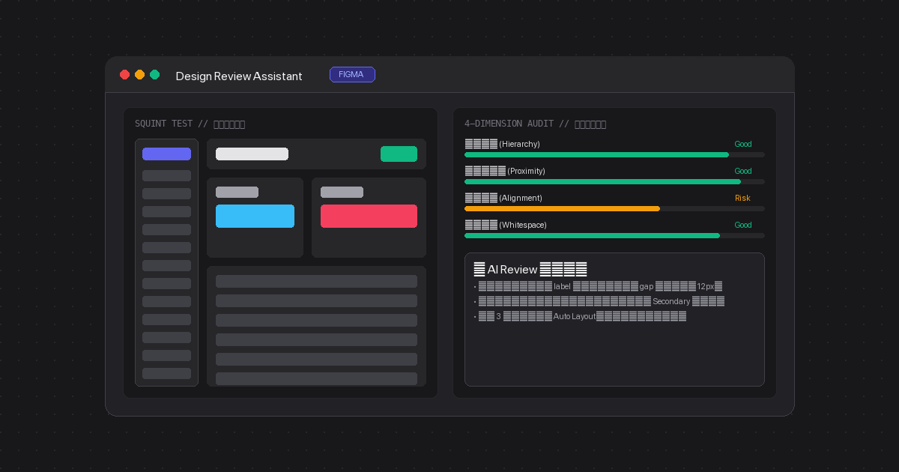

做过 UI/UX 设计或前端开发的人，在审视一个界面时通常都有一个下意识的动作：**把眼睛稍微眯起来，或者把画布缩小到 25%**。

为什么要眯起眼睛？因为人的大脑太容易被具体的字句文案、图标细节和绚丽的配图吸引，从而忽视了更根本的结构硬伤。只有把所有细节模糊掉，你才能看清页面的真正骨架：**信息的主次节奏是对是错？相关的控件有没有抱团？整体的对齐是否有序？页面各区域的留白是在自由呼吸还是逼仄压抑？**

这种“眯眼看稿”（Squint Test）是设计师最宝贵的直觉之一。但现有的辅助工具往往走向两个极端：

一种是传统的规则型 Linter，机械地抓取每个图层是否符合固定的像素数值，报出一堆死板的错误提示，却根本看不懂整体视觉关系；另一种是泛泛而谈的多模态 AI 评语，只给几句空泛的赞美，对具体排版调整毫无指导意义。

为了把“眯眼看稿”的经验真正工程化，我动手写了这个 Figma 插件：[Design Review Assistant](https://github.com/KhalilHsu/Figma_Plugin)。

它的核心理念非常明确：像一个经验丰富、温和专业的设计搭子一样，在不打断你创作节奏的前提下，迅速帮你完成界面结构的透视与诊断。

在设计和实现上，我主要聚焦在三个核心环节：

第一是**低保真结构骨架重构（Squint Test Blocks）**。插件会自动提取选中的 Figma 容器或界面，将其抽象为一套极简的色块布局。它剥离所有琐碎的文字细节，仅保留侧边栏、标题区、表单字段、操作按钮和主内容区的几何体量，让你在一瞬间就能审视整个画面的重心与视觉流动。

第二是**四大视觉维度诊断（4-Dimension Audit）**。从**信息层级（Hierarchy）**、**元素亲密度（Proximity）**、**对齐秩序（Alignment）**和**留白节奏（Whitespace）**四个经典维度出发。不做绝对数值的教条审判，而是基于元素之间的相对关系给出具体、可执行的温和建议，清晰指出哪里的间距过密、哪里的按钮权重失调。

第三是**Figma 原生节点扫描与纯图片（PNG）双模支持**。如果你在编辑原生 Figma 设计稿，插件会深度扫描图层树结构，检查异常行高、未启用 Auto Layout 的容器与非标 Spacing，并支持直接在画布中一键聚焦到问题节点；如果你只是丢进一张外部网页截图或竞品 PNG，它同样能基于视觉直接重建结构块并完成审图。

在工程实现上，项目基于 TypeScript、Vite 与 esbuild 构建，插件运行时完全自包含、无任何臃肿依赖，兼顾了本地开发的毫秒级热重载与极轻的加载负担。

一个好的辅助工具从来不是为了代替人类做决策，而是当你埋头调整了几个小时的像素、产生视觉疲劳时，能在旁边轻轻提醒你一句：“这里的对齐还可以更稳一点”。

> **项目地址**：[GitHub - KhalilHsu/Figma_Plugin](https://github.com/KhalilHsu/Figma_Plugin)
