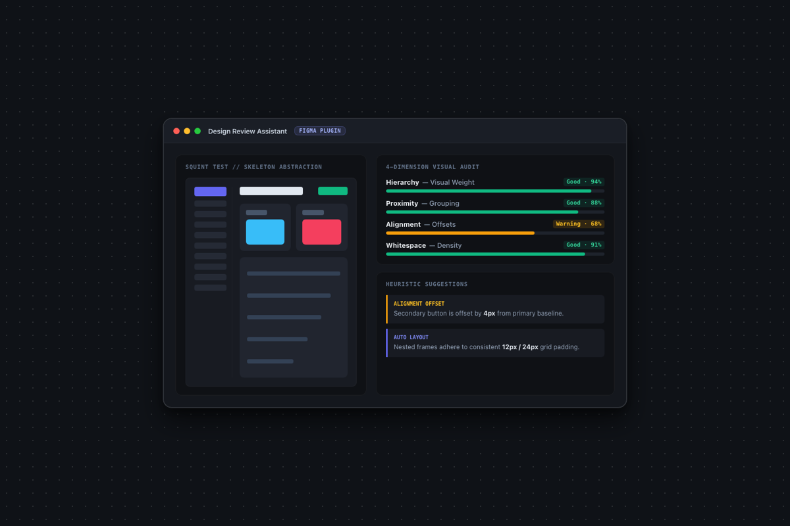

我个人很喜欢用一种方式去判断界面的信息结构：把眼睛稍微眯起来，模糊掉具体的文字文案、图标细节和绚丽配图，然后再对照用户的核心目标，看整个页面的信息结构与视觉重心是不是顺畅的。

为了把这种判断方式变成随时可用的辅助工具，我写了这个 Figma 插件：[Design Review Assistant](https://github.com/KhalilHsu/Figma_Plugin)。

在功能上，主要聚焦在两个核心环节：

- **低保真骨架重构（Squint Test Blocks）**：自动提取选中的 Figma 容器或界面，将其抽象为一套极简的色块布局，剥离所有细节干扰，让你在一瞬间看清画面的几何体量与视觉流动。
- **多维视觉诊断（Visual Audit）**：从信息层级（Hierarchy）、元素亲密度（Proximity）、对齐秩序（Alignment）与留白节奏（Whitespace）等维度出发，基于元素间的相对关系给出具体、可执行的调整建议。

整体插件试了好几版最后也没上 AI，我其实挺讨厌什么都为了 AI 而 AI 的，能固化代码解决的东西，成本更低更稳定，在 AI 能更强之前不需要为了使用而使用。

> **项目地址**：[GitHub - KhalilHsu/Figma_Plugin](https://github.com/KhalilHsu/Figma_Plugin)
