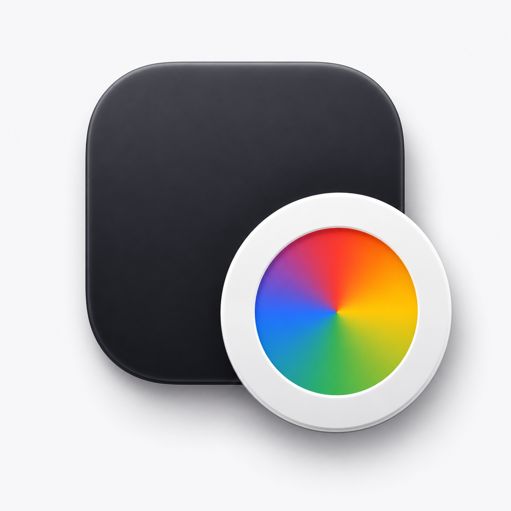

在用过 Arc 浏览器的人里，很多人最怀念的其实不是 Space，也不是侧边栏，而是那个叫 **Little Arc** 的小窗口。

在日常工作流里，我们每天都要从 Slack、飞书、微信、邮件、Notion 或 Linear 点开几十甚至上百个外部链接。大多数时候，我们只是想“顺便看一眼”：扫一下同事发来的截图、复制一个验证码、或者核对一下需求。Little Arc 就像一个极其轻盈的临时缓冲区，随点随看，按一下 `Esc` 就能随手关掉；只有当你真觉得这个页面需要深度阅读或常驻参考时，才把它一键沉淀进主工作区。

但一旦切回 Chrome，这种优雅感就彻底破碎了。

在 Chrome 的世界里，每一次外部链接点击都是对主工作区的一次强行轰炸——不管这个链接有多微不足道，它都会不由分说地在主窗口里新建一个 Tab。半天下来，标签页栏里密密麻麻挤了四五十个网页，你甚至很难分清哪些是正在推进的核心任务，哪些只是半小时前随手瞄了一眼就扔掉的“一次性垃圾”。

解决这个问题的直觉思路通常是：写一个原生的 macOS 悬浮小窗口（比如基于 `WKWebView`）。

但用过类似工具的人都知道，`WKWebView` 虽然窗口形态很原生，却有一个无法忽视的致命硬伤：**它完全割裂了 Chrome 的身份生态**。

你在 Chrome 里的用户资料（Profile）、Cookies、登录态、密码自动填充以及装好的扩展插件，在 `WKWebView` 里统统不存在。每次从 Slack 点开一个 GitHub PR、Linear 工单或公司内网系统，它都会冷冰冰地弹出一堵“请先登录”的鉴权墙。对于重度依赖各类 SaaS 工具的现代工作流来说，这种割裂感是无法接受的。

我们要的不是一个“长得像小窗口的空白浏览器”，而是**带着真实 Chrome 身份与扩展体系的轻量级外链缓冲层**。

为了找回那种克制的外链体验，我动手写了这个工具：[PeekLink（miniChrome）](https://github.com/KhalilHsu/miniChrome)。

它的核心逻辑非常明确：把自己注册为 macOS 的默认浏览器外链代理（Default Browser Proxy），当外部应用发起打开链接请求时，先把链接关进轻量级的 Mini Chrome 缓冲窗口里，由你决定是“看完即走”，还是“提升为主窗口标签页”。

在架构实现上，PeekLink 采用了**两端协同**的设计：

第一是**系统级默认代理（macOS 菜单栏 App）**。完全基于 Swift 原生编写，毫秒级响应并接管操作系统的 HTTP/HTTPS 打开请求。

第二是**常驻伴侣扩展（Chrome Companion Extension）**。驻留在你真实的 Chrome Profile 中，通过官方的 **Native Messaging（原生消息通信）** 协议与 macOS 宿主直连。它直接调用 Chrome 的窗口管理能力拉起纯粹的 Popup 窗口，完整共享所有的 Cookie、登录凭证、密码填充和扩展插件。

通过 Native Messaging 桥接，整个 URL 转发完全在本地的系统管道内完成：既不需要开启任何本地 HTTP 端口，也不依赖脆弱的 AppleScript，更不会产生可见 Bridge 页面导致的多桌面（Spaces）抢焦点与跳屏问题。

在核心体验的设计上，我主要聚焦在三个关键点：

第一是**按需提升与无缝流转（Promote to Chrome）**。在 Mini 窗口里预览完后，如果觉得需要长期保留，只需点击顶部的 Promote 按钮（或按下快捷键），当前标签页会瞬间平滑移入主 Chrome 窗口，成为常驻 Tab。

第二是**智能黄金视口与弹窗拦截**。内置了多显示器智能计算，默认以当前屏幕的 80% 黄金比例居中呈现，既不会将页面挤成拥挤的移动端窄屏，又保持了小窗的克制感；同时捕获 `window.open` 与空白外跳，防止第三方链接再次在主窗口意外弹窗。

第三是**纯粹的本地优先与隐私克制**。零网络上报、零云端依赖，不在本地解析或解密任何 Cookie 数据，所有页面渲染完全交付给真实的 Chrome 引擎本身。

外部链接不应该在被决定保留之前，就提前霸占你宝贵的主浏览器工作区。

把外链关进轻量的缓冲区里，看完随手一关，想留一键提升。把真正清爽、专注的标签页空间，留给真正重要的工作。

> **项目地址**：[GitHub - KhalilHsu/miniChrome](https://github.com/KhalilHsu/miniChrome)
