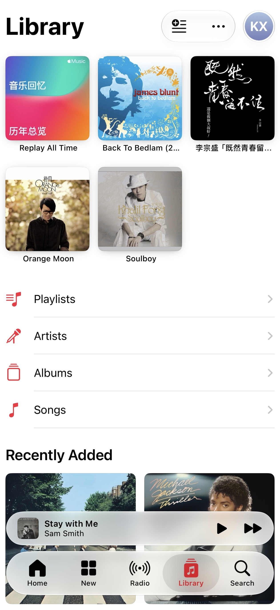
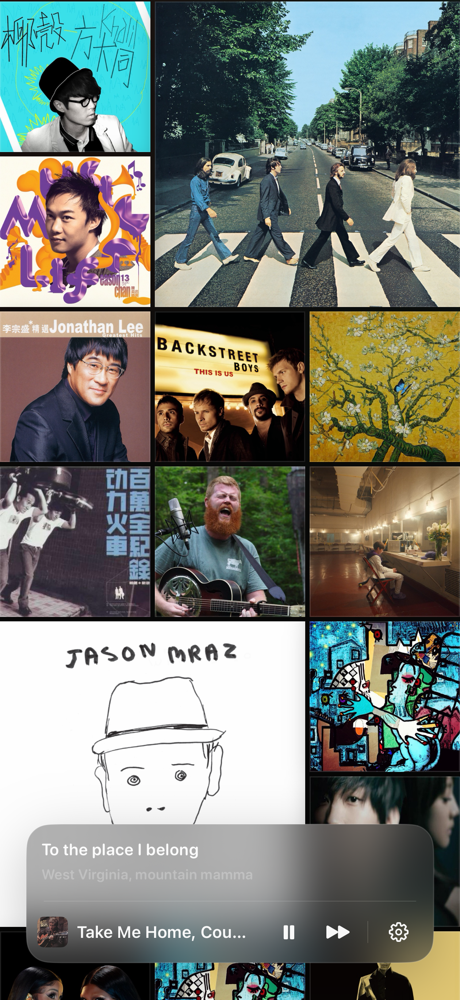

A few months ago, I wrote [Every Album You Listen to Is a Form of Self-Expression](../music-wall-is-growing/), talking about why the album art we love shouldn't be buried away in sterile menus. Back then, I built a project called **Music Wall** and had it running on our living room TV—like a living, breathing personal record gallery.

In everyday life, though, the iPhone and iPad in our hands are the devices we actually spend the most time with. So I rebuilt it from the ground up as a native iOS and iPadOS app, and it's now live on Apple TestFlight.

> 🔗 **TestFlight Beta**: [Join the Music Wall TestFlight Beta](https://testflight.apple.com/join/Hz9BuGK5)

---

### Why Build This App?

At its core, every time I open the official Apple Music app, it just feels a little… **boring**.

Open the Library tab, and what greets you is practically etched in stone: the exact same handful of albums, stubbornly sorted by "Recently Added." Seeing the same covers day after day leaves countless gems buried at the bottom of your collection, completely stripping away any anticipation of serendipity or rediscovery.

What I wanted was simple: **every time I open my music player, I want to immediately bump into a "new old friend"—a familiar face from my own library that hasn't surfaced in ages.**

Driven by that feeling, Music Wall focuses on two core interaction designs:

---

### 1. An Album Photo Wall That's Fresh Every Single Time

In Music Wall, there are no rigid, nested lists. The moment you open the app, you're greeted by an immersive, full-screen wall of album art.

* **Fresh Randomized Layout**: Every time you launch or refresh, the arrangement and sizing of albums across the wall are newly recalculated;
* **Ambient Auto-Drift**: The wall gently and continuously glides up and down on its own, so you don't even have to lift a finger;
* **Subtle 3D Card Flips**: Album covers periodically flip in 3D to an ambient rhythm, giving the entire wall an organic, subtle pulse of life.

It takes hundreds (or thousands) of albums gathering digital dust in your library and weaves them into a living gallery full of serendipitous encounters.

---

### 2. Ditching Clunky Menus: Shake to Shuffle, Elegantly

Shuffling across my entire library is easily my most common habit when listening to music.

Anyone who uses Apple Music knows how frustratingly buried "Shuffle Library" is: tap Library, tap into the monstrous "Songs" list, wait for your phone to chug through thousands of tracks, and then reach up to tap that tiny "Shuffle" button. It's a clunky chore, completely devoid of any tactile joy or flow.

So in Music Wall, I replaced that friction with the most intuitive, tactile gesture possible: **Shake your device**.

Give your phone a gentle shake, and this happens:

1. The background wall instantly dims into a soft vignette with subtle light blooms;
2. The algorithm plucks a random album from your entire library, popping the cover forward in a slick 3D animation to take center stage;
3. Playback kicks in seamlessly, and a floating frosted-glass player rises from the bottom with live lyrics and quick controls.

No menu diving, no waiting around. Just a shake, and the music flows.

---

### Platforms & Requirements

* **Supported Devices**: Universally built for **iPhone** and **iPad** (propped up landscape on an iPad, it doubles as a lovely pocket art frame on your desk);
* **Requirements**: Because the playback engine connects directly to native Apple Music frameworks and your synced local library, an active **Apple Music subscription** is required.
