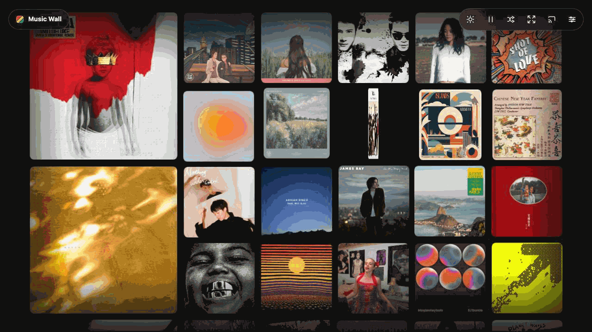

很多人把歌单当成工具，在流媒体软件里匆匆切歌。但在实体唱片时代，一张专辑的封面、色调与设计，原本就是音乐不可分割的一部分。

我觉得，一个人听过的那么多专辑，聚在一起本身就是一种非常生动的自我表达。

既然这些专辑记录了无数个特定时刻的情绪与记忆，为什么要把它们藏在折叠的列表和冰冷的菜单里？

所以我做了 **Music Wall**。

---

它最核心的形态，就是把你听过、收藏的所有专辑封面，完整平铺在一个大屏幕显示设备上（我最初是在电视上跑这个项目）。

画面里的封面会随着节律轻盈地翻转、平移与流动。

当你坐在房间里看着它时，就像在私人画廊里欣赏由自己听歌轨迹搭建起的一整面艺术墙——听觉在耳边流淌，视觉在眼前漫步。

把音乐从手机里的一项后台任务，变成房间里一面会呼吸的墙。它不仅是一个界面，更是让音乐重新回到实体感与空间感的一种尝试。
