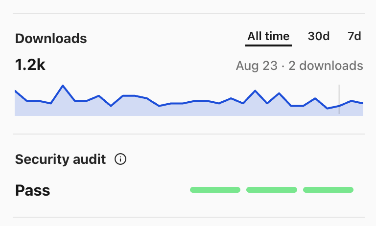
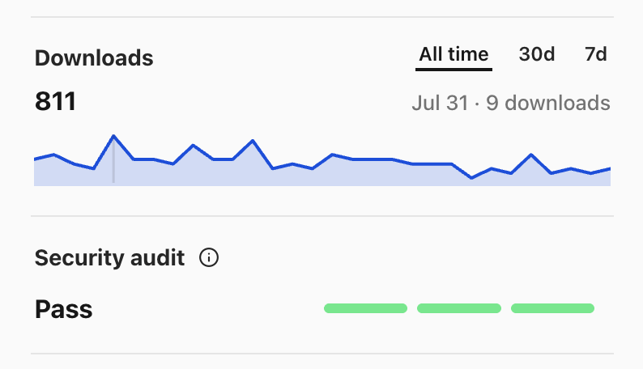

今年 2 月底我刚开始折腾 OpenClaw。当时生态里的大多数 Agent Skill 还停留在比较初级的阶段：写一段看似完备的 System Prompt，然后期待大模型在真实场景里心领神会。

但一旦把 Agent 真正放进复杂的日常工作流，这种“单靠 Prompt 许愿”的脆弱性就会暴露无遗。真实世界充斥着动态渲染的 SPA 网页、反爬拦截、弹窗遮罩，以及堆满无索引截图却再也翻不出来的灵感碎屑。

为了解决手头最高频的两个场景，我动手写了最早的两个 Skill：[Article Summarizer Plus](https://clawhub.ai/khalilhsu/skills/article-summarizer-plus) 和 [UI Inspiration Library](https://clawhub.ai/khalilhsu/skills/ui-inspiration-library)。


这两个 Skill 分别面向内容抓取与视觉资产管理，而在设计它们的过程中，我主要探索了两种完全不同的 Agent 动作模式：

1. **文章抓取的“逐级降级阶梯”**（`@khalilhsu/article-summarizer-plus`）

总结一篇文章听起来是最基础的 Agent 任务，但现代网页的结构对自动化工具极其不友好：短链重定向、SPA 客户端渲染、Cookie 遮罩、动态“阅读全文”展开按钮，以及反爬拦截。很多 Agent 遇到这些情况时，要么抓回一堆空壳 HTML，要么开始对着残缺的开头凭空幻觉。

在这个 Skill 里，我为它设计了一套严格的**轻重升级阶梯（Escalation Ladder）**：

第一是**轻量探测优先**。首选速度最快、消耗最低的纯文本 Fetch 请求；如果发现被反爬阻断或内容残缺，自动平滑切入专用的 Reader 镜像通道（如 `r.jina.ai`）。

第二是**交互式浏览器兜底（Browser Fallback）**。当 Fetch 彻底失效时，Agent 自动拉起真实的无头浏览器环境。像真人一样滚动页面以触发懒加载、自动关闭阻挡阅读的 Modal 弹窗、主动点击“展开阅读更多”，确保获取到完整的正文 DOM。

第三是**正文完整性校验与密度自适应**。总结前强制校验标题与正文是否截断；在遇到短推文与讨论串时，自适应切换为“论点 + 评论区争议焦点”模式，而不是生搬硬套论文式的大纲。如果遇到真的人机验证壁垒，诚实报告阻塞原因，绝不胡乱臆造。

2. **灵感库的“双向检索与视觉回传”**（`@khalilhsu/ui-inspiration-library`）

我们在做产品和界面设计时，都会随手截下大量的优质 UI 案例。但绝大多数截图最后的宿命，都是在本地相册或某个 `Screenshots` 文件夹里沦为永远不会被打开的“数字墓地”。收集非常廉价，但**检索极其昂贵**。当你想做一个“黑金配色的 SaaS Pricing 页面”时，你根本不可能从几千张未分类的图片里找出来。

这个 Skill 的核心定位不是一个单向的“截图归档器”，而是一个**活的双向视觉检索系统**：

第一是**多维结构化入库（Archive Mode）**。Agent 接收到截图后，会自动分析界面的页面类型（Page Type）、视觉风格（Style Tags）、核心组件（Components）和业务场景（Use Cases），将规范化的元数据和原图同步存入 Notion 等结构化数据库。

第二是**图片优先的视觉回传（Retrieval Mode）**。这是我觉得最关键的一点：当用户询问“帮我找几个极简风的移动端导航参考”时，Agent 不能只扔回冷冰冰的文字列表或数据库 ID，而是必须**优先回传真实的图片预览与匹配理由**。设计参考的本质是视觉刺激，文字只能作为辅助决策的注脚。

第三是**防御性隐私与防噪边界**。Agent 在入库前会主动识别低分辨率无价值图片，或者包含敏感财务数据、个人信息的后台截图，及时发出警示或拦截，避免污染知识库。

两个 Skill 均已发布到 ClawHub，可以通过 OpenClaw CLI 直接安装使用：

```sh
# 1. 网页文章精准提取与结构化摘要
openclaw skills install @khalilhsu/article-summarizer-plus

# 2. UI 灵感多维入库与图片优先检索
openclaw skills install @khalilhsu/ui-inspiration-library
```

挺有意思的一点是，虽然这两个 Skill 已经写了快半年，但直到现在，在 OpenClaw 的生态里它们每天依然有稳定的几次下载（目前累计已经有两千多次安装）：




这两个 Skill 跑通之后，我最大的体会是：**写 Agent Skill 的本质，从来不是在调教 Prompt 的修辞，而是在为 Agent 设计一套严密的「操作纪律与容错状态机」**。

知道什么时候用最轻的手段探路，什么时候果断调用重型工具；知道在信息缺失时优雅降级，在交付结果时给出符合人类感官的形态。把这些边界想清楚了，Agent 才能真正从一个会说话的玩具，变成一个靠谱的日常协作者。

> **ClawHub 主页**：[@khalilhsu on ClawHub](https://clawhub.ai/khalilhsu)
> **Skill 源码与文档**：[Article Summarizer Plus](https://clawhub.ai/khalilhsu/skills/article-summarizer-plus) · [UI Inspiration Library](https://clawhub.ai/khalilhsu/skills/ui-inspiration-library)
