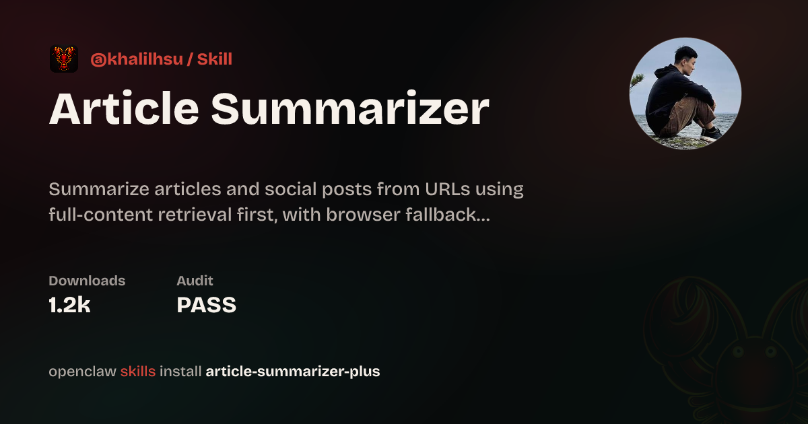
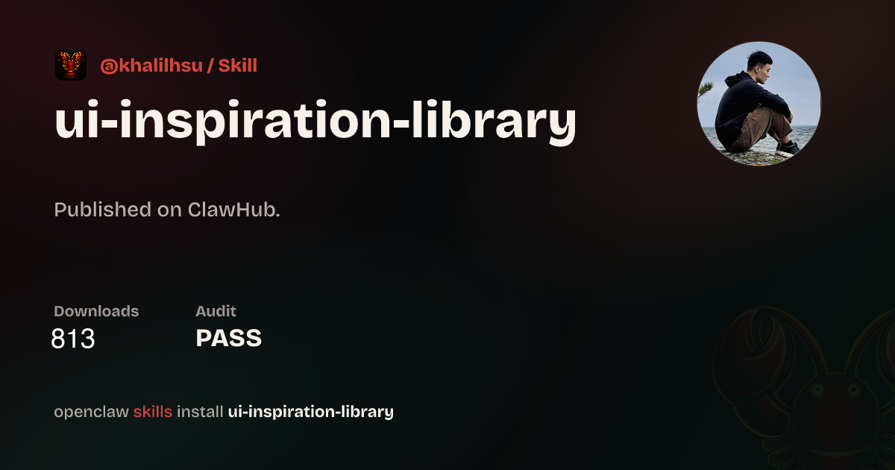

Back when I first started tinkering with OpenClaw, I spent hours talking with it every single day—often losing track of time until 2:00 or 3:00 in the morning. It was during that obsessive phase that I first thought about writing custom Skills for myself.

I wasn’t aiming to build some grandiose, universal utility. I just tailored them to my own quirks. I built two:




**Article Summarizer Plus** came from my inbox dilemma: I subscribe to tons of newsletters, but rarely have the energy to open them without knowing if they're worth my attention. I wanted OpenClaw to triage them first—give me a punchy TL;DR of what an article actually says before I commit to reading the full piece.

**UI Inspiration Library** solved my chaotic screenshot habit. I’ve always saved UI design references into Notion, but as the database swelled, finding anything was a nightmare. Good luck digging up that sleek black-and-gold pricing page reference when you actually need it. This Skill lets OpenClaw automatically tag, describe, and categorize design snapshots the moment I save them, so I can pull them up later with fuzzy semantic search.

After publishing both to ClawHub, the reception took me by surprise—they’ve accumulated thousands of installs, with people still downloading them daily. I guess these friction points were universal enough that plenty of builders shared the exact same itch.

BTW, Skills and Sandboxes were probably the two most badass AI product paradigms to emerge in 2025.

If you have similar workflows, feel free to grab them:

```sh
openclaw skills install @khalilhsu/article-summarizer-plus
openclaw skills install @khalilhsu/ui-inspiration-library
```

> **ClawHub Profile**: [@khalilhsu on ClawHub](https://clawhub.ai/khalilhsu)  
> **Source & Documentation**: [Article Summarizer Plus](https://clawhub.ai/khalilhsu/skills/article-summarizer-plus) · [UI Inspiration Library](https://clawhub.ai/khalilhsu/skills/ui-inspiration-library)
