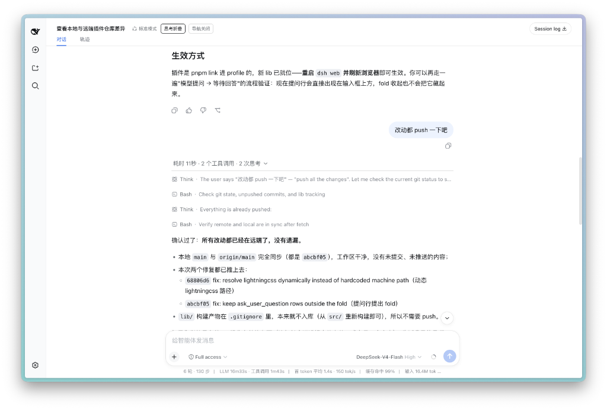

DeepSeek Harness 开源后，我直接接入 DeepSeek V4 / V4 Pro 的 API 搭起来体验了一下。出发点很简单：原汤化原食，看看它的原生工程能力到底如何。

整体架构很清晰，但 Web GUI 在一些 Agent 交互细节上还比较简陋。正好它是开源的，我就顺手写了两个 UI 插件：

1. **信息展示折叠**（`@khalilhsu/dsh-ui-conversation-folded`）：Agent 在多轮推理与 Tool Call 时的思考过程和日志会全部铺开，造成信息轰炸。这个插件把每一轮的中间活动折叠收纳在可滚动视窗内，只把最终结论保留在外层。




2. **长上下文定位**（`@khalilhsu/dsh-ui-query-navigator`）：在 1M 长上下文和多轮密集对话下，回看历史提问反复上下滚动很繁琐。这个插件在左侧提取每一轮 Query 作为时间轴锚点，支持滚动高亮、悬停预览与一键点击跳转。


做这两个插件，大概花了 10 多块钱的 API 费用（消耗约 1.6 亿 Tokens）：


两个插件已开源并发布到 npm，可以通过官方插件机制直接安装：

```sh
# 1. 单轮中间过程折叠
dsh plugin --profile web add @khalilhsu/dsh-ui-conversation-folded

# 2. 左轨 Query 导航器
dsh plugin --profile web add @khalilhsu/dsh-ui-query-navigator
```

源码仓库：[KhalilHsu/dsh-plugins](https://github.com/KhalilHsu/dsh-plugins)。

