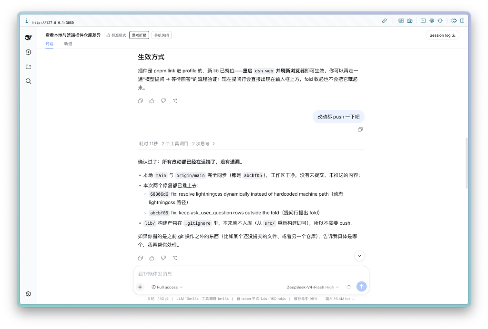

As soon as DeepSeek Harness was open-sourced, I hooked up the DeepSeek V4 / V4 Pro API and took it for a spin. My motivation was simple: dogfooding to the extreme—see what its raw software engineering chops look like when tasked with improving its own runtime.

The overall architecture is clean, but the default Web GUI leaves a lot to be desired in agent interaction polish. Since it's fully open-source, I hacked together two lightweight UI plugins:

1. **Activity Log Collapser** (`@khalilhsu/dsh-ui-conversation-folded`): During multi-turn reasoning and dense tool calls, intermediate scratchpads and raw execution logs dump directly into the main thread, causing severe visual noise. This plugin neatly bundles intermediate tool runs and thought processes into a scrollable accordion, keeping only final answers visible in the primary stream.




2. **Long-Context Query Navigator** (`@khalilhsu/dsh-ui-query-navigator`): When dealing with 1M token context windows and dozens of conversational turns, scrolling endlessly through a giant canvas just to find an earlier prompt is painful. This plugin pins an anchor timeline along the left rail, providing scroll-synchronized highlights, hover previews, and instant click-to-jump navigation across all previous queries.


Building these two plugins ran up around ¥10 (~$1.50) in API costs, chewing through roughly 160 million tokens:


Both plugins are open-source and published to npm. You can install them directly via the official CLI:

```sh
# 1. Fold intermediate agent runs
dsh plugin --profile web add @khalilhsu/dsh-ui-conversation-folded

# 2. Left-rail query timeline navigator
dsh plugin --profile web add @khalilhsu/dsh-ui-query-navigator
```

Source code: [KhalilHsu/dsh-plugins](https://github.com/KhalilHsu/dsh-plugins).
