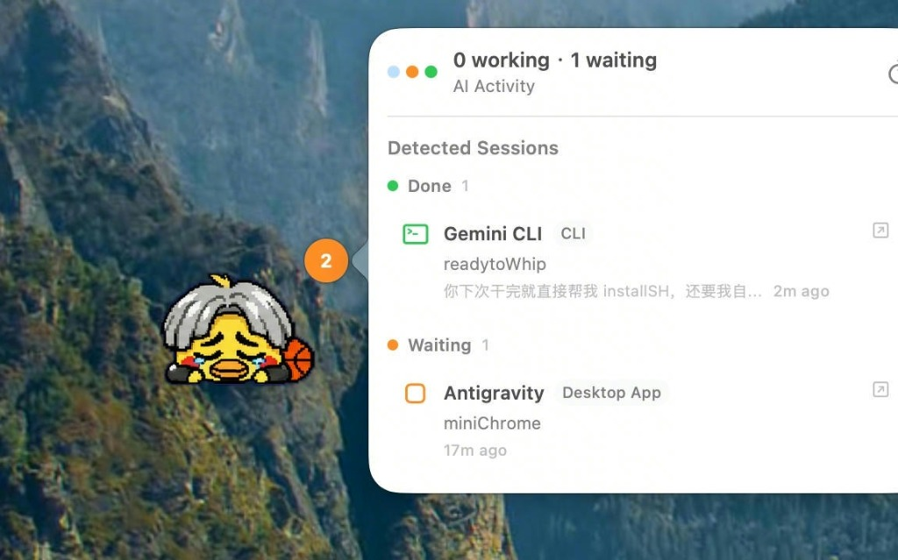
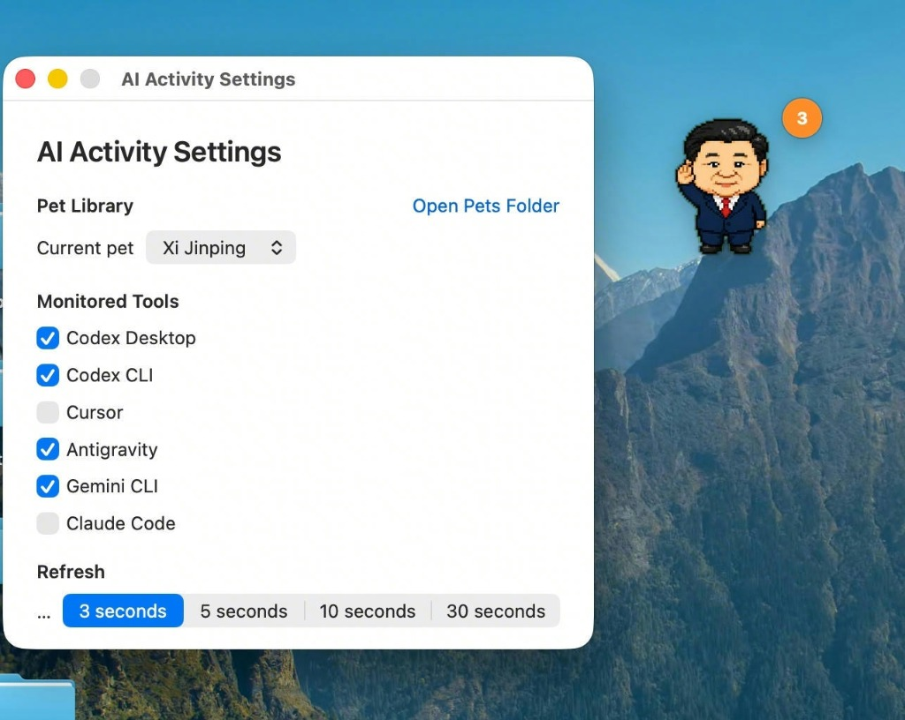

最近 AI 桌面宠物似乎成了新风潮，Claude 和 Codex 社区都开始给自己的 Agent 穿上可爱的皮套。

但在真实的环境里，极少有人只用某一个单一的 Agent。以我自己的日常工作流为例：Codex Desktop/Antigravity 并行，终端里可能还同时挂着一些 Gemini CLI 跑。

如果每个 Agent 都在屏幕上放一个专属宠物，桌面瞬间就变成了动物园，满屏乱跳反而成了视觉负担。

我想要的是一个 **All-in-One 的状态中枢**：一只安静呆在屏幕角落的宠物，但能同时看懂我 Mac 上所有 Agent 的实时动态。

于是，我动手写了这个原生的 macOS 小工具：[ReadyToWhip](https://github.com/KhalilHsu/readytoWhip)。

---

平时它只是一个安静悬浮在屏幕边缘的像素小宠物。

无论后台有多少个 Agent 在跑，只要点一下它，就会展开一个原生的毛玻璃半透明看板，清晰地告诉你各个 Agent 当前正在哪个项目里干什么、谁在等待你的输入、谁已经完成了任务。

我也给它做了非常开放的皮肤系统：支持通用的 Petdex / WebP 动图与 Spritesheet 帧动画格式。

点击设置面板里的 `Open Pets Folder`，把任何喜欢的 WebP 动图或资源包丢进去，就能无缝切换成你喜欢的任意桌面宠物。

让一群 Agent 替我打工的同时，还能顺便在桌面上“云养坤”，写代码时的心情都轻盈了不少。

> **项目地址**：[GitHub - KhalilHsu/readytoWhip](https://github.com/KhalilHsu/readytoWhip)
